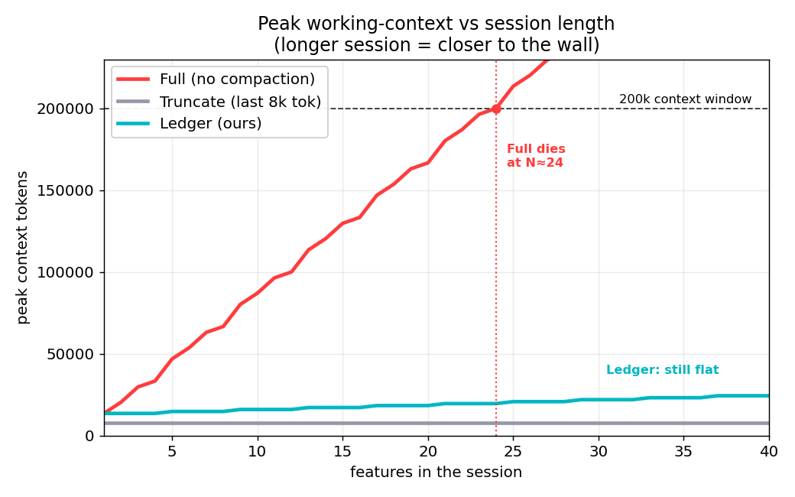
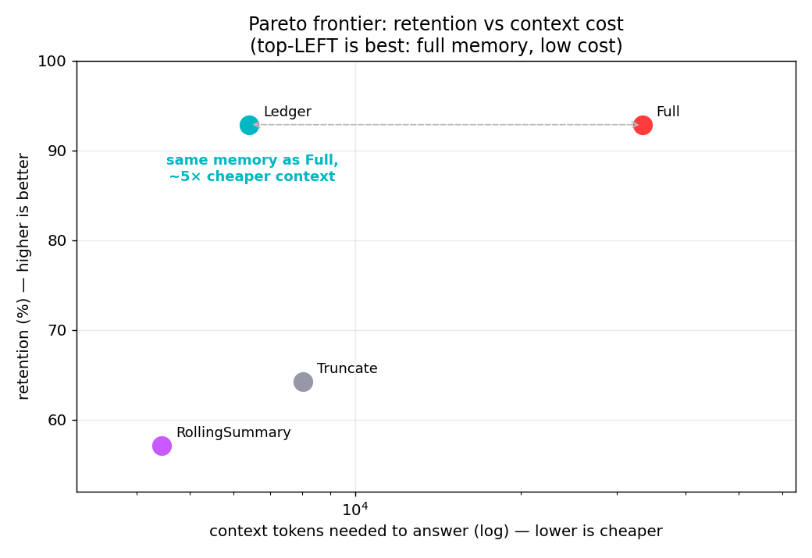

# Context Ledger

**Commit-boundary context compaction for long-horizon coding agents.**

An agent building a product feature-by-feature accumulates context until it hits
the model's window and either fails mid-task or gets bluntly summarized (losing
detail it can't recover). Context Ledger fixes this at the natural seam — the
**git commit**. When a feature is committed, its ~10k tokens of build context
(file reads, reasoning, tool output, diffs) are replaced with a compact,
**structured** ledger entry that keeps the decisions, the public interfaces, and
— crucially — a **git pointer** to the exact bytes. The pointer is what makes
eviction *safe*: when later work needs an evicted detail, the agent
**rehydrates** it from git on demand.

> The committed code + git history *is* the external memory. The commit isn't
> just "done" — it's the lossless store that makes it safe to evict the context
> that produced it.

This is "restorable compression" (drop the content, keep the handle) applied at a
semantic boundary. See [`RESEARCH.md`](RESEARCH.md) for how it relates to the
state of the art (Anthropic context-editing + memory tool, MemGPT/Letta,
Manus, Cline Memory Bank, MEM1 / "Memory as Action").

## The result, in one line

On a **real** 4-feature build (this project's sibling repo), Context Ledger
**matches full-context retention of earlier-feature facts while keeping the
working context ~30× smaller** — and projected over session length it runs
**~28× longer before hitting the 200k window**, *losslessly*, where naive
truncation forgets and naive summarization loses detail it cannot recover.



*Peak working-context vs session length (cycling the 4 real features). Full
(no compaction) crosses the 200k window at N≈24 features and dies; Ledger stays
flat (~277 tok/feature) and reaches the wall only at N≈673.*

### Pareto frontier — retention vs context cost



Retention = % of 14 factual probes about earlier features answered correctly
from only the retained context (same model judges every strategy):

| strategy | retention | answer ctx | resting ctx |
|---|--:|--:|--:|
| Full (no compaction) | 93% | 33,347 | 33,347 |
| Truncate (last 8k)   | 64% |  8,016 |  8,016 |
| RollingSummary       | 57% |  4,440 |  4,440 |
| **Ledger (ours)**    | **93%** | **6,411** | **1,223** |

Ledger **ties Full's retention at 5× lower cost** and **beats the lossy
baselines by 29–36 points** — the top-left of the frontier. The baselines
can't reach it because they aren't restorable: Truncate forgets the oldest
feature; RollingSummary's prose drops the specifics; Ledger keeps a git
pointer and recovers them.

## How it works

```
feature 0  build (≈13k tok) ── commit ──▶  ledger entry 0 (≈300 tok)  + git SHA
feature 1  build (≈ 7k tok) ── commit ──▶  ledger entry 1 (≈300 tok)  + git SHA
feature 2  build (≈ 9k tok) ── commit ──▶  ledger entry 2 (≈300 tok)  + git SHA
...
working context  =  system  +  Σ ledger entries (compact)  +  current feature
when a probe needs evicted detail:  retrieve relevant entry → `git show <sha>` → answer
```

A ledger entry keeps: the human-authored commit message (where decisions and
gotchas live), the public interface signatures touched (what later features
depend on), the changed-file map, and the rehydrate pointer. Everything else is
recoverable from git and therefore safe to drop.

## Install

```bash
git clone https://github.com/wiztek-llc/context-ledger
cd context-ledger && ./install.sh
```

Installs the `ctxledger` CLI and (opt-in) the **live Claude Code hooks**. Revert
with `./uninstall.sh`. Non-interactive: `./install.sh --with-hooks` /
`--no-hooks` / `--with-bench`.

## Live integration — runs on your real builds

With the hooks installed, Context Ledger works automatically:

- **after every `git commit`** → a compact ledger entry is recorded to
  `<project>/.claude/context-ledger.md` and injected into context (a
  `PostToolUse` hook on `git commit`), so the agent knows that feature's build
  detail is now safe to compact.
- **at session start** → the ledger is re-injected (a `SessionStart` hook), so
  the compacted feature memory **survives compaction and new sessions**.

The CLI works standalone too:

```bash
ctxledger doctor                 # is it wired up here? what's recorded? what to do next
ctxledger install-git-hook       # bulletproof: record EVERY commit (make/deploy/IDE), not just `git commit`
ctxledger record                 # extract HEAD commit → append a ledger entry
ctxledger show                   # print the project ledger
ctxledger rehydrate <sha> [path] # recover exact evicted detail from git
ctxledger stats                  # features recorded · tokens saved · compression
```

**"Is it even working?"** Run `ctxledger doctor` in any project — it checks the
git repo, the installed hooks, and how many features/tokens have been recorded,
and tells you the next step. The hooks load at **session start**, so if you
installed them while a session was already open, restart it once.

This is the deployable form of the mechanism the benchmark proves: the ledger
file is the durable, restorable memory; git is the lossless store.

## Reproduce everything

```bash
./run_all.sh            # venv + tests + scaling + retention benchmark + charts + scoreboard
```

The benchmark runs on a **bundled real corpus** (`corpus/statusline.bundle`,
materialized into `.corpus/` on first run) so the published numbers reproduce
identically after a fresh clone — no personal paths, no network for the
deterministic parts. Point at any repo with `CL_REPO=/path/to/repo`.

- **Deterministic** parts (token curves, scaling, compression, rehydration) are
  exact and need no network.
- The **retention** benchmark calls the local `claude -p` once per
  (strategy, probe), **cached** on disk so re-runs are instant and every LLM
  output is inspectable in `bench/cache/`. The **same model** answers for every
  strategy, so the comparison is fair.

```bash
.venv/bin/python tests/test_engine.py     # 16 deterministic engine checks
.venv/bin/python bench/demo.py            # live: a fact Truncate forgets but Ledger recovers
.venv/bin/python bench/summary.py         # the scoreboard
```

## What's measured (and what isn't)

- **Retention** = % of factual probes about earlier features answered correctly,
  using *only* the context that strategy retained at the end of the session
  (the hardest case — the oldest feature is the most compacted). Facts are real
  details of the build; docs (`.md`) are excluded from the reconstructed build
  context so a later feature's README can't leak earlier features' facts (that
  would unfairly help recency-based baselines).
- **Cost** = tokens of context needed to answer (for Ledger this includes the
  rehydration it pays on demand).
- Honest limitations are in [`RESEARCH.md`](RESEARCH.md#limitations): retrieval
  can miss; rehydration costs tokens when invoked; the commit is a good but
  imperfect boundary.

## Layout

```
cl/            engine: tokens · session(from git) · ledger · strategies · llm(cached)
bench/         probes · run(retention) · scaling · plot · summary · demo
tests/         deterministic engine tests
artifacts/     results.json · scaling.json · *.png
```
