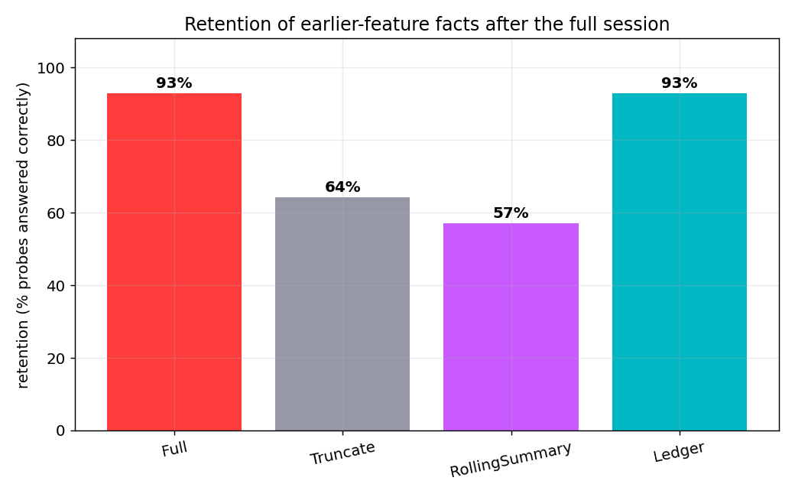

# Results

Corpus: **4 real features** reconstructed from the git history of the
`cc-gradient-statusline` project (33,331 tokens of code-only build context).
Every number below is reproducible with `./run_all.sh`. Deterministic numbers
need no network; retention numbers come from `claude -p` (same model for every
strategy, cached in `bench/cache/`).

## Deterministic (exact, verify by hand against git)

**Per-feature compression** — raw build context → ledger entry:

| feature | raw tok | entry tok | ratio |
|--------:|--------:|----------:|------:|
| 0 gradient status line | 13,527 | 263 | 51× |
| 1 real-time limits     |  6,823 | 261 | 26× |
| 2 auto-compaction      |  9,367 | 362 | 26× |
| 3 time hooks           |  3,614 | 311 | 12× |
| **total** | **33,331** | **1,197** | **28×** |

**Resting working-context after each commit:**

| after feature | 0 | 1 | 2 | 3 |
|---|--:|--:|--:|--:|
| Full      | 13,543 | 20,366 | 29,733 | 33,347 |
| Ledger    | 286 | 548 | 911 | **1,223** |

Final resting context **27× smaller**, and Ledger's is *restorable*.

**Scaling** (cycling the 4 real features to N-feature sessions):

| | growth/feature | hits 200k window at |
|---|--:|--:|
| Full   | 8,333 tok | **N ≈ 24 features** (then dies) |
| Ledger |   277 tok | **N ≈ 673 features** |

→ **~28× longer runway before the context wall**, losslessly.

**Restorability:** an evicted gotcha is recovered verbatim from git —
`git show 8e361a3` → *"Avoid `ps -A`, which can take seconds on a busy process
table."* Retrieval over the 14 probes had **0 misses**.

**Fact availability** (is the ground-truth fact in the retained context?):

| strategy | available | mean answer ctx |
|---|--:|--:|
| Full (no compaction) | 14/14 | 33,347 |
| Truncate (last 8k)   | 11/14 |  8,016 |
| **Ledger (ours)**    | **14/14** | **6,411** |

Truncate permanently loses `oauth_endpoint`, `pill_bg`, `bg_rearm` (oldest
features, outside the recent window). Ledger has all 14 — 10 from the compact
ledger, 4 recovered via git — at **5× less context than Full**.

## LLM-judged retention (same model answers every strategy)

Each strategy answered all 14 probes from only its retained context, via
`claude -p` (Haiku 4.5), judged against ground truth. Raw answers are in
`artifacts/results.json`.

| strategy | retention | mean answer ctx | resting ctx |
|---|--:|--:|--:|
| Full (no compaction) | 93% | 33,347 | 33,347 |
| Truncate (last 8k)   | 64% |  8,016 |  8,016 |
| RollingSummary (6k)  | 57% |  4,440 |  4,440 |
| **Ledger (ours)**    | **93%** | **6,411** | **1,223** |

**Ledger ties Full's 93% retention** (full-context-level memory) while using
**5× less context to answer** and a **27× smaller resting state** — and it
**beats RollingSummary by 36 points and Truncate by 29 points**. The lossy
baselines cannot reach this point because they are not *restorable*: when a
fact falls out of the window (Truncate) or out of the summary (RollingSummary),
it is gone. Ledger keeps a git pointer and recovers it.

### The decisive case (from `bench/demo.py`)

Question about the *oldest* feature — "what RGB is the pill background?":

```
Full           → CORRECT  ((22,23,30) still in its 33k context)
Truncate(8k)   → "NOT IN CONTEXT"   (feature 0 fell out of the window)
RollingSummary → "NOT IN CONTEXT"   (the RGB didn't survive the prose summary)
Ledger (ours)  → CORRECT  — rehydrated `BG_FILL = (22, 23, 30)` from git show d720ad7a
```



